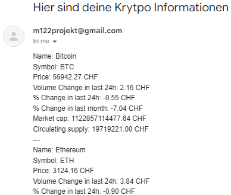

# CryptoAnalytics

Zeigt Crypto Marktdaten an.

# Projektangaben

## Auftraggeber

Parisi Corrado

## Projektbeginn

14.06.2024

## Projektende/-abgabe

19.07.2024 (?)

## Beschreibung

Zeigt mithilfe der CoinMarketCap API verschiedene Marktdaten einer Kryptowährung der Wahl an.

## Projektteam

- Marzo Nevio
- Reichlin David

## Annahmen und Beschränkungen

- Anzahl der API Abfragen auf 10'000 beschränkt
- Keine kostenpflichtige API Services

## Terminvorgaben

| Datum           | Meilenstein                             |
|-----------------|-----------------------------------------|
| 14.06.          | Abgabe Projektantrag                    |
| 28.06.          | Abgabe Design (Aktivitätsdiagramm)      |
| 12.06. / 19.06. | Projektdemo & Abgabe Code mit Kommentar |
| 12.06. / 19.06. | Abgabe: Testbericht und Dokumentation   |

# Dependencies

- [wkhtmltopdf](https://wkhtmltopdf.org/)

# Features

- Kriegt verschiedene Kryptowährung-Informationen mit der CoinMarketAPI.
- Versendet Daten per Mail an benutzerdefinierte Empfänger.
- Daten die per Mails verschickt werden, werden formatiert für leserlichkeit und Übersicht.
- Mails können an mehreren Empfängern versendet werden.
- Wichtige Daten / Credentials werden extern gespeichert.
- Die Anzahl Währungen, von denen Daten geholt werden, kann mit Parametern angepasst werden.

# Showcase

Crypto Analytics benutzt die CoinMarketCap API, um aktuelle Informationen der Kryptowährungen anzuzeigen. Diese werden
dann formatiert und per Mail versendet.

Die Mail sieht wie folgt aus:

|  |
|:------------------------------------------------:|
|               Krypto Informationen               |

# License

Dieses Programm steht unter der [GNU General Public License v3.0](LICENSE)
